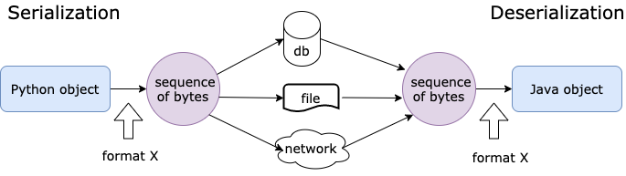
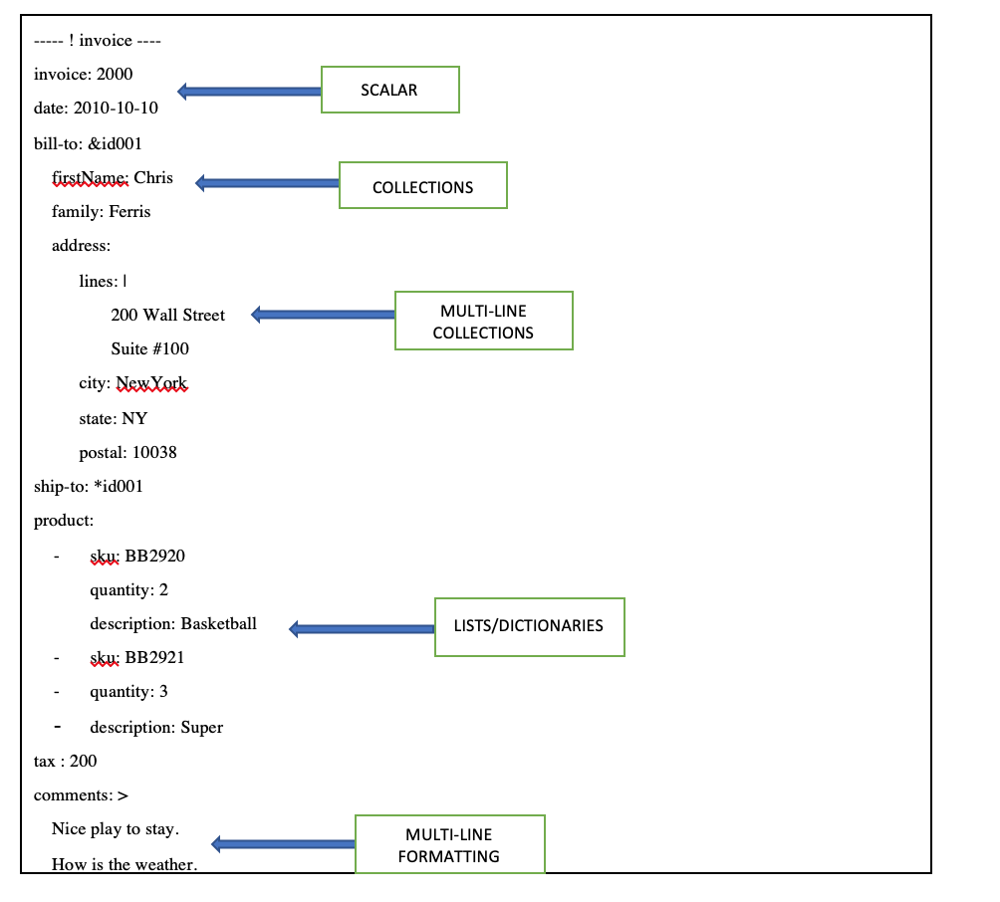

# Yaml

## Content

### What is Yaml ?

- Yaml is Aint't a Markup Langauge .
- Data serialtion language

### Why Need Yaml ?

- Yaml need a standard, agreed, language/synatx to communicate
- XML, JSON, Yaml



### Make a compare between Yaml and Json and XML ?

**(Eamples hostname:App-1, manufacturer:HP, tire:Backend)**

### Yaml - Use Cases

- configuration files
- log file
- inter-process messaging
- cross-lanauge data sharing
- object persis ...

### Yaml Examples with Samll explaintion

### Yaml - Data Structures

- Three basic :

  - scalars (string , numbers ,boolean)
  - mappings (hashes or dictionaries)
  - sequences (array or list )

- yaml leverages the above three structures and adds:
  - a simple typing system and
  - aliasing mechanism

### Yaml - Structure - Comment

```yaml
# this is comment
person:
  name: ali
  age: 3
  gender: male
```

### yaml - Structure & Rules - Start and End of Doc

```yaml
---
time: 01:01:10
```

### yaml data sturctures `key/value` pairs

```yaml
personName: ali
person_name: hassan
person-name: mohamed
person name: Ali
date: yyyy-mm-dd HH:MM:SS
```

> cannot assign variable with 2 differnet way

```yaml
student: ali
    name: name
    age: 23
    grade: 11
student 2: ali
```



### yaml - String & quotes

- when a string contains special charaters (:(){},&), it needs to be escaped by either single- or double-quotes
- write URL

### yaml Dictionaries / Mapping / Hashes

```yaml
# this is Object
person:
  name:
    fname: ali
    lname: hassan
  age: 12
  grade: 23
```

### yaml block collections: use of indentation - spaces

> Make examples to show the important for spaces

### Yaml is superset of json

```yaml
person: { name: "hassan", gender: "famle", age: 33 }
```

### yaml : lists / arrays

```yaml
students:
  - Mohamed salah
  - Amit Gupta
  - John Smith
  - name: ali
  - age: gamal
car_part: ["tires", "engine", "gas tank"]
```

### Yaml datastructure `nesting/ mixing structure`

> dictionary in list way 1

```yaml
# dictionary in list
play_games:
  - name: ali
    game: 10
  - name: ali
    games: hassan
```

> Map in list way 1

```yaml
play_games:
  - name: ali
    age: 10
  - name: hassan
    age: 3
```

> Map in list Way 2

```yaml
# map in list
play_games:
  name: hassan
  games_played: 100
  years_played:
    - 1998
    - 2002
    - 2020
  teams: ["a", "b"]
```

> list in list

```yaml
player_games:
  - name: ali
  - age: 23
  - injuries:
      - knee
      - shoulder
      - shin
```

### yaml Advenced feature

> Multi-line strings

```yaml
bash:
  - |
    #!bin/bash
        dnf update -y
        dnf install httpd -y
        systemctl start httpd service
        echo "this is serve *2*" > /var/www/html/index.html
name: ali
accomplishment: >
  ali was the president of 
  kid's world bank from 
  1919 through 2020.
```

> Yaml - Complex Key

```yaml
? - line one
  - line tow
: valiue
? this is key for us
  this cofdf
: sodfij
```

> Yaml - Aliases/Anchors

```yaml
anchored_content: &n1 this is anchoer key
use_ref: *n1
# merge
- step1: &d1
    inf: lasisk 2000
    type: doc
- step2:
    <<: *d1
    owner: hassan
# merge with override
- step1: &d1
    inf: lasisk 2000
    type: doc
- step2:
    <<: *d1
    inf: lasisk 2001
```

### Introduction to API

- What API and what use yaml in api cyclelife?

### An Example Kubernetes YAML Definition File

```yaml
apiVersion: v1
kind: Pod
metadata:
  name: static-web
  labels:
    role: myrole
spec:
  containers:
    - name: web
      image: nginx
      ports:
        - name: web
          containerPort: 80
          protocol: TCP
```
